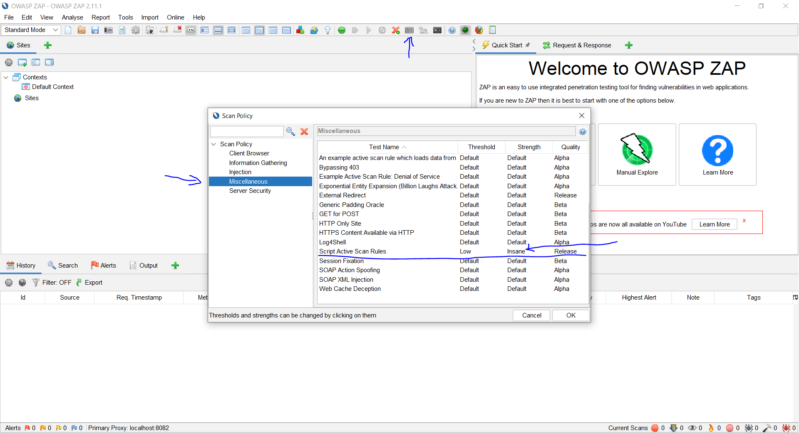

# Documentation and instructions

## ZAP automated DAST setup

1. Download ZAP at [here](https://www.zaproxy.org/download/)
2. In the ZAP UI, go to Tools>Options>API
   - generate random API key and copy it to zap.py line 5
   - for debugging purposes Enable web UI
   - make sure API is enabled and where you want it to be (localhost)
3. In Tools>Options>Local Proxies, the port is defined. In this project the port is on 8082 to prevent interferences with other applications on port 8080. Maintain your chosen Port in zap.py line 6
4. In Tools>Options>Active Scan make sure Maximum Rule Duration is high enough to not prematurely stopping custom scripts (or 0 for full run of all scripts)

### setting up an example location

The next steps need values specific to the application to be tested, so getting the location is the next step. The example values in zap.py refer to testing [Ethicsassessmentsoftware](https://github.com/FelixOliverLange/EthicsAssessmentSoftware) by Felix Lange running as described [here](https://github.com/FelixOliverLange/EthicsAssessmentSoftware#with-docker-compose).

### variables that need to get maintained in Python

go to zap.py

- line 8: maintain location where reports should get stored to
- line 9: maintain link to OpenAPI specification
- line 10: maintain **REGEX** of **ALL** endpoints that might (and will) be attacked
- line 12: maintain prefix of the report name that will be generated
- line 13: maintain all scripts you want to make sure are included

### scan policies

scan policies define which Active Scan rules get executed with which intensity. Make sure the Script Active Scan Rules Strenght is on insane if you want to guarantee they run completely.

In zap.py, the name of the Scan policy to be used is handed over when calling the RunActiveScan([Scan policy name]) function. In ZAP/scan_policies two example policies are defined, one that only runs the active Rules script and one that is the default scan rule with the active rules script intensity on Insane.
To include the provided scan rules, go on the scan rule icon (screenshot above) and click on import.

### Active Rules scripts

In zap UI, active rules script get maintained here: 
When activated, they automatically get run in the active scan. The two example scripts in ZAP/scripts are the ones described in this [report](https://github.tools.sap/I538925/T3_2000-Philipp/blob/main/Praxisbericht.pdf)  in Section 3.2.1 *Scripting in ZAP*.

 The scanNode() function gets run on every endopoint to be scanned, the scan() function on every *recognized* parameter.

### Conclusion

- a correctly configured instance of ZAP is running
- zap.py is correctly customized
- the application to be tested is running

You should be now able to successfully execute zap.py and produce results in a report.

